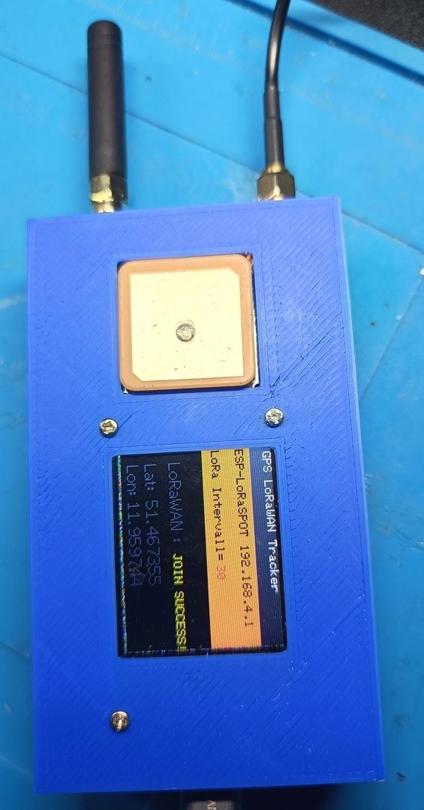

# ESP32 GPS LoRaWAN Tracker

GPS LoRaWAN-Tracker auf Basis eines ESP32 mit LoRa-Modul SX1262 und GPS-Modul NEO-7M, und TFT-Display

## Funktionen

Der Tracker zeichnet anhand der GPS- Daten die LoRa-WAN Verfügbarkeit auf. Über das TTN- Netzwerk werden die Koordinaten auf 

einem Raspi4 / OMV Datenspeicher abgelegt und können über einem WEB- Service ausgewertet werden.

## Hardware

### Controller

* ESP32

### GPS

* NEO-7M Modul
* GPS / GLONASS / Galileo
* serielle Kommunikation

### LoRa

* SX 1262
* Kommunikation über Gateway Raspi4/SX1302 TTN
* Upload über TTN

### Display

* TFT
* 128 × 160 Pixel

user setup :
#define ST7735_DRIVER
#define ST7735_BLACKTAB   // <<< Wichtig für zentriertes Bild!

#define TFT_MOSI 23
#define TFT_SCLK 18
#define TFT_CS   5
#define TFT_DC   2
#define TFT_RST  4
#define TFT_MISO -1

#define LOAD_GLCD
#define LOAD_FONT2
#define LOAD_FONT4
#define SMOOTH_FONT
#define SPI_FREQUENCY 27000000

## Pinbelegung

### GPS

#define GPS_RX      16
#define GPS_TX      17

### LoRa

#define LORA_SCK   18
#define LORA_MISO  19
#define LORA_MOSI  23

#define LORA_CS    15
#define LORA_DIO1  33
#define LORA_RST   27
#define LORA_BUSY  32

## Schaltplan

#####################

## Software

# Vorbereitung Filesystem:

* _Little_FS_init.ino 

Sketch wird vor Laden der Software in den EEPROM geladen. Er dient zum Verwalten des Tracking- Intervalls 

## Code

* Projektdatei
GPS_LoRaWAN_Tracker.ino

* globale Konfiguration
config.h

* Displaymanagement
display.h
display.cpp

* Filesystem zum Verwalten des Tracking- Intervalls
filesystem.h
filesystem.cpp

* GPS- Funktionen
gps.h
gps.cpp

* LoRa- Funktionen
lorawan.h
lorawan.cpp

* lokaler Hotspot zur Einstellung des Intervalls über WEB- Seite
wifi_ap.h
wifi_ap.cpp

## Funktionen

Nach Einschalten kann sich über den lkokalen HotSpot: ESP-LoRaSPOT (192.168.4.1) auf eine WEB-Seite verbunden werden

und das Tracking- Intervall festgelegt werden, z.B. "30" für 30s

Der Tracker verbindet sich mit GPS. Wenn er GPS- Koordinaten gefunden hat und ein verfügbares LoRaWAN-Gateway sendet er die GPS- 

Daten und die Gateway- Informationen in das TTN. Über die Upload- Funktion werden die Daten auf einem OMV- Server abgelegt.

#####################  Bild

## Hinweise

Der GPS-Empfang ist abhängig von Umgebung, Antennenposition und Sicht zum Himmel.

Die Genauigkeit der aufgezeichneten Position und Höhe hängt von der Qualität der GNSS-Daten und den verwendeten Sensoren ab.

Der aktuelle Sketch verwendet einen festen WLAN-Access-Point mit den oben genannten Zugangsdaten.

## Autor

**Joachim Reuter**

## Version

**ESP32 GPS LoRaWAN Tracker – Version 2**
